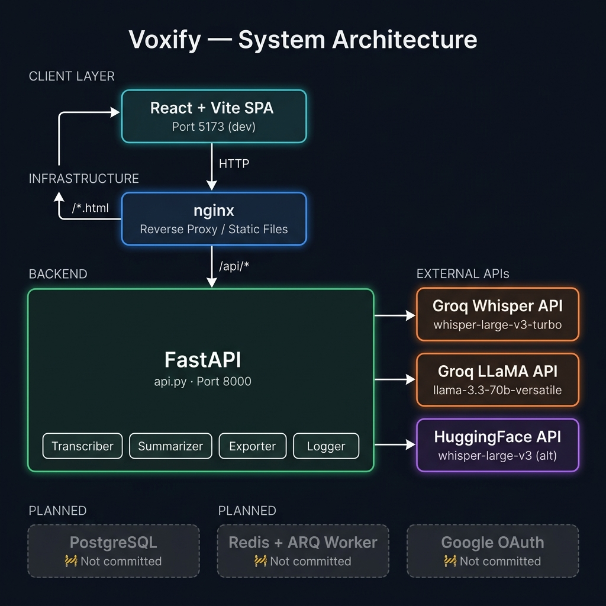
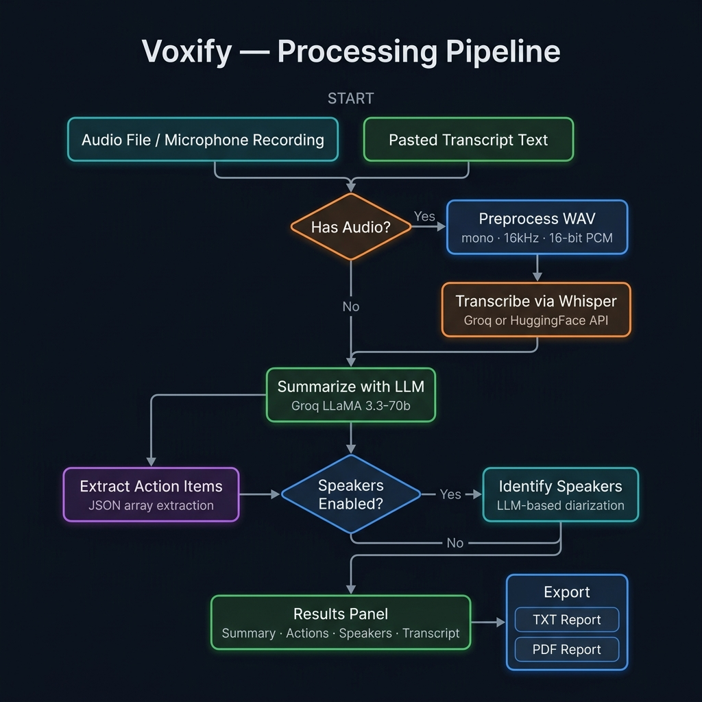
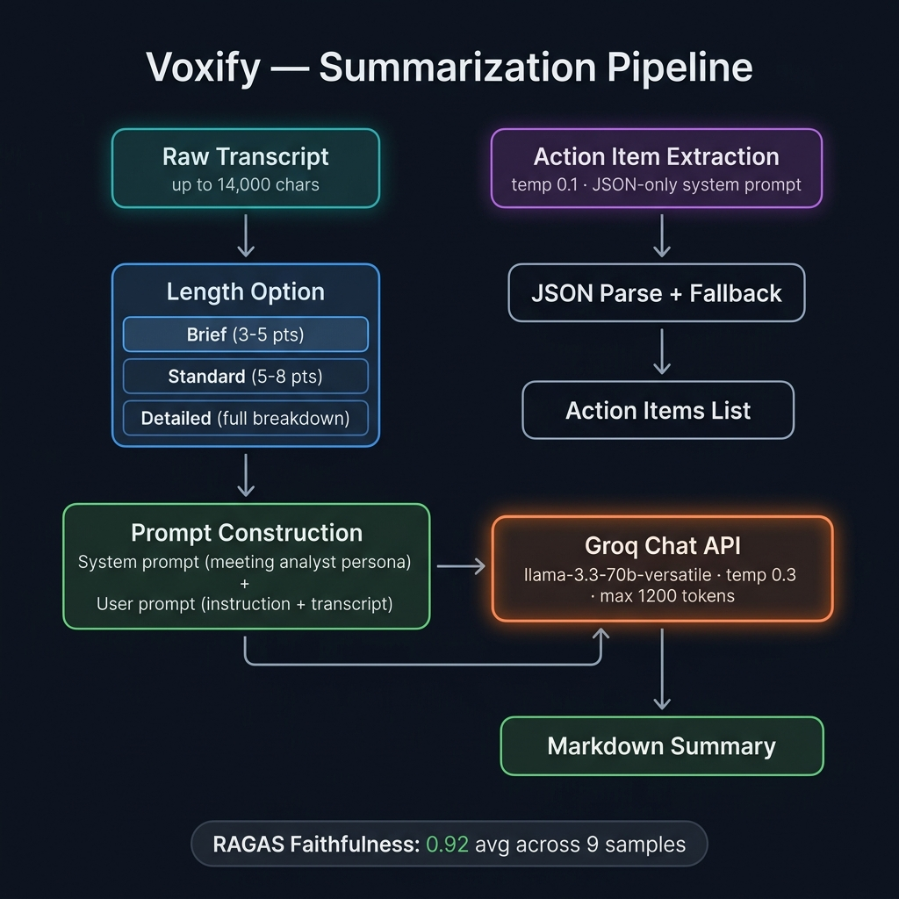

<h1 align="center">Voxify — Meeting & Lecture Summarizer</h1>

<p align="center">
  <em>Quiet notes for loud meetings.</em>
</p>

<p align="center">
  
  
  
  
  
  

</p>

---

## What is Voxify?

Voxify is an open-source web app that transcribes meeting and lecture audio using **Whisper** (via Groq or HuggingFace) and generates structured, Markdown-formatted notes — summaries, action items, and speaker labels — using **LLaMA 3.3-70b** through Groq's ultra-fast inference API.

Upload a file, record live in the browser, or paste a transcript. Voxify returns organised notes in the time it takes to refill your coffee. Export to TXT or PDF when you're done.

---

## Feature Highlights

| Feature | What it does | How it works | Status |
|---|---|---|---|
| **Audio Transcription** | Converts audio to text with timestamps and language detection | Groq Whisper Large v3 Turbo or HuggingFace Whisper API | ✅ Shipped |
| **AI Summarization** | Generates structured Markdown summaries at 3 depth levels | Groq LLaMA 3.3-70b with tailored system prompts | ✅ Shipped |
| **Action Item Extraction** | Pulls concrete tasks, owners, and follow-ups from transcripts | LLM with JSON-only system prompt + fallback parsing | ✅ Shipped |
| **Speaker Diarization** | Labels who said what in multi-speaker conversations | LLM-based conversational shift analysis | ✅ Shipped |
| **TXT / PDF Export** | Downloadable formatted reports with all analysis sections | Server-side generation via fpdf2 | ✅ Shipped |
| **Live Microphone Recording** | Record directly in the browser — no install needed | MediaRecorder API → WAV → API upload | ✅ Shipped |
| **RAGAS Evaluation** | Measures hallucination rate of generated summaries | RAGAS Faithfulness metric (0.92 avg on 9 samples) | ✅ Shipped |
| **Google OAuth + Persistence** | User accounts, meeting history, background processing | PostgreSQL, Redis/ARQ workers, JWT auth | 🚧 In progress |

---

## Architecture

<p align="center">
  
</p>

The committed codebase runs as a **two-service stack**: a React SPA served by nginx, and a FastAPI backend that proxies to external AI APIs. There is no database or queue in the committed version — all processing is synchronous and stateless.

> **Note:** The `docker-compose.yml` references PostgreSQL, Redis, and an ARQ worker service. The backend code for these (`app/` directory) is not yet committed to the repository. The Docker path currently will **not** build from a fresh clone. See [Deployment](#deployment) for details.

---

## Processing Pipeline

<p align="center">
  
</p>

---

## Features (Detailed)

### Transcription

- Two engine options: **Groq** (recommended, faster) and **HuggingFace** (fallback)
- Groq returns timestamps, language detection, and segment-level data
- HuggingFace returns plain text only (no timestamps, estimated duration from file size)
- WAV files are automatically preprocessed: converted to mono, 16 kHz, 16-bit PCM
- Supports `.mp3`, `.mp4`, `.wav`, `.m4a`, `.ogg`, `.flac`, `.webm` uploads
- 25 MB file size limit enforced both client-side and server-side

### Summarization

- Three summary depth levels:
  - **Brief** — 3–5 concise bullet points
  - **Standard** — 5–8 points covering all main topics
  - **Detailed** — Full breakdown with overview, key points, decisions, and next steps
- Powered by Groq-hosted open-source LLMs (no OpenAI dependency):
  - `llama-3.3-70b-versatile` (recommended)
  - `llama-3.1-8b-instant` (fast)
  - `llama3-70b-8192` (balanced)
- Transcripts truncated to 14,000 characters for context window safety
- Output is Markdown-formatted for clean rendering

### Action Item Extraction

- Extracts tasks, decisions, and follow-ups as a JSON array
- Uses a constrained system prompt (JSON-only, no Markdown fences)
- Gracefully degrades: returns `[]` on parse failure instead of crashing

### Speaker Diarization(Huristic)

- LLM-based (not acoustic) — analyzes conversational patterns, not voice embeddings
- Labels speakers as `Speaker 1`, `Speaker 2`, etc.
- Detects monologues and labels accordingly
- Optional — toggled via the settings drawer

### Export

- **TXT**: Formatted plain-text report with sections for summary, action items, and full transcript
- **PDF**: Branded report with headers, section titles, pagination, and safe latin-1 encoding for international characters
- Both generated server-side and streamed as downloads

### Live Recording

- Uses the browser's `MediaRecorder` API to capture microphone input
- Audio chunks assembled into a WAV blob and uploaded to the API
- No audio leaves the client until the user explicitly submits

### 🚧 Planned (Not Yet Committed)

- **Google OAuth** — Login flow with JWT tokens (frontend routes exist, backend not committed)
- **PostgreSQL persistence** — Meeting storage with user accounts (schema/models not committed)
- **Redis + ARQ workers** — Background job queue for async transcription/summarization (docker-compose references exist, worker code not committed)
- **RAG chat** — Chat with meeting transcripts using pgvector embeddings (frontend API call exists, backend not committed)
- **Alembic migrations** — Database schema management (alembic.ini exists locally, not committed)

---

## Tech Stack

| Layer | Technology | Purpose |
|---|---|---|
| **Backend** | FastAPI 0.136 + Uvicorn | REST API, audio preprocessing, request routing |
| **Frontend** | React 19 + Vite 8 | SPA with settings drawer, results panel, recording UI |
| **Styling** | Vanilla CSS (design system) | Warm cream/earthy theme with serif headings (Instrument Serif + Inter) |
| **STT** | Groq Whisper API / HuggingFace Inference API | Speech-to-text (whisper-large-v3-turbo) |
| **LLM** | Groq Chat API (LLaMA 3.3-70b) | Summarization, action items, speaker diarization |
| **PDF** | fpdf2 | Server-side PDF report generation |
| **Evaluation** | RAGAS + LangChain-Groq | Faithfulness scoring for summary quality |
| **Reverse Proxy** | nginx (alpine) | Serves frontend, proxies `/api/*` to backend |
| **Containerization** | Docker + Docker Compose | Multi-stage builds, multi-service orchestration |
| **CI/CD** | GitHub Actions | Lint → test → build → push to GHCR |
| **Deployment** | Render (IaC via `render.yaml`) | Free-tier hosting for backend + frontend |
| **Testing** | pytest + Vitest | Backend unit tests + frontend component/API tests |
| 🚧 **Database** | PostgreSQL + SQLAlchemy + Alembic | User accounts, meeting persistence (not committed) |
| 🚧 **Queue** | Redis + ARQ | Background job processing (not committed) |
| 🚧 **Auth** | Google OAuth + python-jose JWT | User authentication (not committed) |
| 🚧 **Embeddings** | pgvector + sentence-transformers | RAG chat over transcripts (not committed) |

---

## Project Structure

```
voxify/
├── api.py                          # FastAPI backend — endpoints for transcribe, summarize, speakers, export
├── utils/
│   ├── __init__.py
│   ├── transcriber.py              # Groq Whisper + HuggingFace Whisper clients
│   ├── summarizer.py               # LLM summarization, action items, speaker ID via Groq Chat API
│   ├── exporter.py                 # TXT and PDF report generation (fpdf2)
│   └── logger.py                   # Centralized logging to stdout
├── frontend/
│   ├── index.html                  # Vite entry point
│   ├── package.json                # React 19, Vite 8, lucide-react, react-markdown, react-router-dom
│   ├── vite.config.js              # Vite config with VITE_API_URL env injection
│   ├── vitest.config.js            # Vitest test config (jsdom)
│   ├── eslint.config.js            # ESLint config for React
│   ├── public/
│   │   └── favicon.svg             # App icon
│   └── src/
│       ├── main.jsx                # React DOM entry
│       ├── App.jsx                 # Root component — navbar, hero, workspace, recording, auth gate
│       ├── api.js                  # API client — fetch wrappers + auth helpers (token management)
│       ├── constants.js            # Sample transcript, LLM model options, length options
│       ├── index.css               # Full design system — warm cream/earthy theme (1800+ lines)
│       ├── components/
│       │   ├── ResultsPanel.jsx    # Displays summary, transcript, action items, speakers, export buttons
│       │   └── SettingsDrawer.jsx  # Slide-out panel for engine, API key, model, and toggle settings
│       └── __tests__/
│           ├── setup.js            # Vitest setup (testing-library/jest-dom)
│           ├── App.test.jsx        # Component tests — rendering, sample transcript, file size, API key
│           └── api.test.js         # API function tests — fetch mock, success/error paths
├── tests/
│   ├── conftest.py                 # Pytest fixtures — TestClient, DB session, auth headers, WAV bytes
│   ├── test_exporter.py            # Unit tests for TXT/PDF export (4 tests)
│   └── test_summarizer.py          # Unit tests for summarize + action items with mocked Groq API (6 tests)
├── eval/
│   ├── evaluate_model.py           # RAGAS Faithfulness evaluation script
│   ├── eval_data.json              # 20 eval cases — meetings + lectures with varied summary depths
│   ├── evaluation_results.json     # Results: 0.92 avg faithfulness across 9 samples
│   └── README.md                   # Eval setup and usage instructions
├── backend.Dockerfile              # Multi-stage Python 3.11 + ffmpeg (non-root user)
├── frontend.Dockerfile             # Multi-stage Node 20 build → nginx:alpine
├── docker-compose.yml              # 4 services: backend, frontend, redis, worker
├── nginx.conf                      # Reverse proxy config — /api/* → backend, SPA catch-all, gzip
├── render.yaml                     # Render IaC blueprint — backend + frontend services
├── .github/
│   └── workflows/
│       ├── ci.yml                  # Lint → test-backend → test-frontend → build+push to GHCR
│       └── deploy.yml              # Tag-triggered SSH deploy with docker compose
├── requirements.txt                # Production Python dependencies (18 packages)
├── requirements-dev.txt            # Test + eval dependencies (pytest, ragas, ruff, etc.)
├── pytest.ini                      # Pytest config
├── .env.example                    # Template for required environment variables
├── .gitignore                      # Python, Node, IDE, OS ignores
├── .dockerignore                   # Docker build exclusions
└── LICENSE                         # MIT License
```

---

## Prerequisites

| Requirement | Version | Notes |
|---|---|---|
| **Python** | 3.11+ | Required for backend |
| **Node.js** | 20+ | Required for frontend |
| **Groq API Key** | — | Free at [console.groq.com](https://console.groq.com). Required for transcription and summarization |
| **HuggingFace API Key** | — | Optional. Only needed if using the HuggingFace transcription engine |
| **Docker** + **Docker Compose** | — | Optional. For containerized deployment (⚠️ see Docker caveats below) |

> **Caveat:** The committed code runs entirely through external API calls to Groq/HuggingFace. There is no local model inference. You must have a valid API key to use any feature beyond the UI itself.

---

## Quick Start

### Local Development (Verified ✅)

This is the tested path. Runs the legacy `api.py` monolith directly.

**1. Clone and install backend:**

```bash
git clone https://github.com/vaishnavi-newalkar/Voxify-Meeting-Lecture-Summarizer.git
cd Voxify-Meeting-Lecture-Summarizer

python -m venv venv
# Windows
venv\Scripts\activate
# macOS/Linux
source venv/bin/activate

pip install -r requirements.txt
```

**2. Start the backend:**

```bash
uvicorn api:app --host 0.0.0.0 --port 8000 --reload
```

The API is now available at `http://localhost:8000`. Interactive docs at `http://localhost:8000/docs`.

**3. Install and start the frontend:**

```bash
cd frontend
npm install
npm run dev
```

The frontend is now available at `http://localhost:5173`.

**4. Configure:** Open the app in your browser, click **Settings**, and enter your Groq API key.

### Docker (⚠️ Caveats)

The `docker-compose.yml` is committed but references `app.main:app` and `arq app.worker.WorkerSettings` — modules that are **not yet committed** to the repository. A `docker compose up` from a fresh clone will fail at runtime.

If you want to run only the frontend container (static build + nginx):

```bash
docker build -f frontend.Dockerfile -t voxify-frontend .
docker run -p 3000:80 -e BACKEND_URL=http://host.docker.internal:8000 voxify-frontend
```

This serves the React build behind nginx, proxying `/api/*` to your locally-running backend.

---

## Summarization Pipeline Explained

<p align="center">
  
</p>

The core differentiator is a **two-pass LLM pipeline** over the transcript:

1. **Summarization pass** — The transcript (truncated to 14K chars) is sent to Groq's LLaMA 3.3-70b with a meeting-analyst system prompt and a user-selected depth instruction (Brief / Standard / Detailed). Temperature is set to 0.3 for consistency. The LLM returns a Markdown-formatted summary.

2. **Action item pass** — The same transcript is sent to a separate LLM call with a JSON-only system prompt at temperature 0.1. The response is parsed as a JSON array. If the LLM returns invalid JSON (e.g., wraps it in Markdown fences), the parser strips fences and retries. On total failure, it returns an empty list — never crashes.

**Evaluation:** Summaries are benchmarked using the [RAGAS Faithfulness](https://docs.ragas.io/) metric, which measures what fraction of claims in the summary are supported by the source transcript. Across 9 evaluation samples (meetings and lectures at varied depth levels), Voxify achieved an **average faithfulness score of 0.92** (best: 1.0, worst: 0.79).

---

## Testing

### Backend Tests

```bash
# From the project root
pip install -r requirements-dev.txt
pytest tests/ -v
```

**What they cover:**
- `test_summarizer.py` — 6 tests: summarization returns Markdown, empty input guard, API error propagation, action item extraction, JSON parse failure fallback
- `test_exporter.py` — 4 tests: TXT section formatting, empty input handling, PDF generation (magic bytes), special character encoding

> **⚠️ Caveat:** The committed `conftest.py` imports from `app.auth.jwt`, `app.db.session`, and `app.models.user` — modules that are **not committed** to the repository. Running `pytest` from a fresh clone will fail with `ModuleNotFoundError`. The exporter and summarizer tests can be run individually: `pytest tests/test_exporter.py tests/test_summarizer.py -v`

### Frontend Tests

```bash
cd frontend
npm install
npm test              # or: npx vitest run
npm run test:coverage # with coverage report
```

**What they cover:**
- `App.test.jsx` — 4 tests: component renders, sample transcript button, file size validation (>25MB), API key requirement
- `api.test.js` — 4 tests: transcribe/summarize fetch calls return data on success, throw on failure

> **⚠️ Caveat:** `App.test.jsx` renders `<App />` without a router wrapper, but `App.jsx` uses `useLocation` and `useNavigate` from react-router-dom. These tests may fail without additional setup depending on your test environment.

### Evaluation

```bash
# Requires a valid GROQ_API_KEY in .env
pip install ragas langchain-groq python-dotenv
python eval/evaluate_model.py
```

Runs 20 transcripts through the real summarization pipeline and scores them with RAGAS Faithfulness. Takes ~8–15 minutes.

---

## Deployment

### Render (render.yaml)

The repository includes a [Render Blueprint](https://docs.render.com/infrastructure-as-code) (`render.yaml`) that defines two services:

| Service | Type | Dockerfile | Plan |
|---|---|---|---|
| `voxify-backend` | Web Service | `backend.Dockerfile` | Free |
| `voxify-frontend` | Web Service | `frontend.Dockerfile` | Free |

**⚠️ Caveat:** The `backend.Dockerfile` CMD runs `uvicorn app.main:app` which requires the uncommitted `app/` package. To deploy the committed code on Render, you would need to change the CMD to `uvicorn api:app --host 0.0.0.0 --port ${PORT}`.

Required Render environment variables: `GROQ_API_KEY`, `CORS_ORIGINS`.

### Docker Compose

```bash
docker compose up --build
```

Defines 4 services: `backend`, `frontend`, `redis`, `worker`.

**⚠️ Current state:** The `worker` service and the backend CMD reference uncommitted code. This will not work from a fresh clone. The `frontend` and `redis` services will start, but the backend will crash.

### CI/CD (GitHub Actions)

Two workflows are committed:

| Workflow | Trigger | What it does |
|---|---|---|
| `ci.yml` | Push/PR to `main` | Lint (ruff + eslint) → test backend → test frontend → build + push Docker images to GHCR |
| `deploy.yml` | Version tag (`v*.*.*`) | SSH into server → `docker compose pull` → `docker compose up -d` |

---

## Contributing

1. **Fork** the repository
2. **Create a branch** for your feature: `git checkout -b feature/your-feature`
3. **Write tests** for any new functionality
4. **Run linting** before committing:
   ```bash
   # Backend
   pip install ruff
   ruff check . --fix

   # Frontend
   cd frontend && npm run lint
   ```
5. **Run tests** to make sure nothing is broken:
   ```bash
   pytest tests/test_exporter.py tests/test_summarizer.py -v
   cd frontend && npm test
   ```
6. **Open a Pull Request** against `main` with a clear description of your changes

---
## Acknowledgements

| Dependency | Role |
|---|---|
| [Groq](https://groq.com) | Ultra-fast inference API for Whisper and LLaMA models |
| [Meta LLaMA 3.3](https://llama.meta.com) | Open-source LLM powering summarization |
| [OpenAI Whisper](https://github.com/openai/whisper) | Speech-to-text model (accessed via Groq/HuggingFace) |
| [FastAPI](https://fastapi.tiangolo.com) | Python web framework |
| [React](https://react.dev) | Frontend UI library |
| [Vite](https://vitejs.dev) | Frontend build tool |
| [fpdf2](https://py-pdf.github.io/fpdf2/) | PDF generation |
| [RAGAS](https://docs.ragas.io) | LLM evaluation framework |
| [lucide-react](https://lucide.dev) | Icon library |
| [react-markdown](https://github.com/remarkjs/react-markdown) | Markdown rendering in React |

---

<p align="center">
  <strong>Voxify</strong> · quiet notes for loud meetings<br />
  Built by <a href="https://github.com/vaishnavi-newalkar">Vaishnavi Newalkar</a>
</p>
